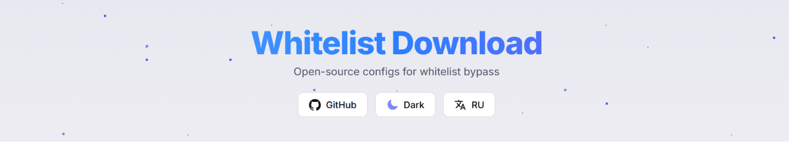
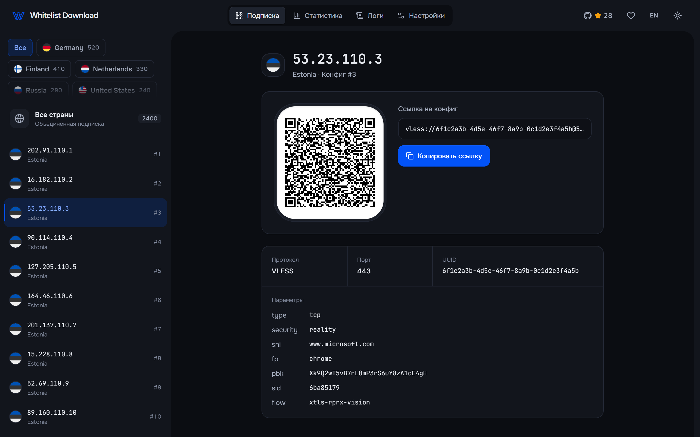

<div align="center">
  
  <p align="center">
    
    
    
  </p>


**Автоматический агрегатор VLESS-конфигов и локальный сервер подписок.**

*Ваш локальный сервер конфигов*
</div>

---

### 📖 О проекте

Скрипт предназначен для автоматического сбора бесплатных **VLESS-конфигов** из проверенных GitHub-репозиториев. Он объединяет тысячи серверов в одну компактную ссылку-подписку (Subscription link), которую понимает любой современный VPN-клиент. Служит локальной базой данных конфигураций.

> [!IMPORTANT]
> **3800+ актуальных конфигураций** обновляются автоматически: по умолчанию каждые 15 минут, интервал настраивается.

---

### 📃 Будущие изменения

- 

Также предлагайте свои идеи в **Issues**


---

### ✨ Основные возможности

- 🖥️ **Web-дашборд:** Статистика, QR-коды, логи и настройки в светлой и тёмной теме, на компьютере и телефоне.
- 🔄 **Auto-Update:** Свежие конфиги по расписанию без вашего участия; обновление можно поставить на паузу.
- 🧭 **Трей:** Статус, пауза, интервал, уровень проверки, уведомления и обновление приложения прямо из меню в трее.
- 📥 **Импорт:** Скачивание конфигов файлом `.txt` по стране, количеству и смещению.
- 🌐 **Local Server:** Поднимает HTTP-сервер на порту `55000` для раздачи подписки.
- 🪟 **Windows Stealth:** Автоматическая пропись в реестр и тихий запуск при старте системы.
- 🧪 **Smart Filtering:** Умное управление лимитами (`/sub/50` или `/sub/10-30`), чтобы не перегружать клиент.
- 🛡️ **Bypass:** Эффективный обход блокировок через актуальные "белые списки".
- ⚡ **Test:** Проверка на работоспособность по пингу или с помощью ядра sing-box.
- ✂ **Clean:** Отсеивает рекламу и мусор из источников, приводя все конфигурации к единому формату.

---

### ⚠️ Важные примечания

> [!WARNING]
> Ссылка на подписку иногда может не работать в мобильной версии **v2RayTun**.

> [!CAUTION]
> Иногда антивирус (Windows Defender) может выдавать предупреждение при первом запуске, так как программа работает с сетью и реестром (автозагрузка).

---

### 🚀 Быстрый старт

#### Установка (Windows)
Скачайте и запустите .exe файл. Программа запустит локальный HTTP-сервер.

#### Установка (Linux)
В терминале рядом с файлом выполните:
```bash
      chmod +x wl-download-linux
      ./wl-download-linux
```
Запустите файл
#### Установка (MacOS)
1. Скачайте файл под архитектуру вашей системы.
2. Откройте **Консоль**.
3. Напишите в Консоле `cd ` (Оставьте пробел).
4. Из Finder перетащите папку с файлом прямо в консоль и нажмите **Enter** (Mac сам подставит путь к папке).
5. Выполните в консоли:
```Bash
chmod +x wl-download-darwin-arm64 # Замените arm64 на amd64, если скачали версию для Intel
```
6. Запустите файл командой `./wl-download-darwin-arm64` (также замените arm64 на amd64 для Intel).

#### Установка через Docker
Убедитесь, что у вас установлен Docker и Docker Compose.
1. Скачайте репозиторий: `git clone https://github.com/rom5n/whitelist-download.git`
2. Перейдите в папку проекта: `cd whitelist-download`
3. Выполните команду для запуска:
```bash
docker compose up -d --build
```
Контейнер автоматически соберется и запустится в фоне. Ваши настройки и конфигурации будут надежно сохранены в локальной папке `data/`. В контейнере приложение работает без трея: управление — через web-дашборд.
#### Подключение в клиент
1. Нажмите на иконку в трее → **«Скопировать ссылку на подписку»**, или откройте [web-дашборд](https://github.com/rom5n/whitelist-download#-web-%D0%B4%D0%B0%D1%88%D0%B1%D0%BE%D1%80%D0%B4) и отсканируйте QR-код.
2. Ссылка выглядит так: `http://ВАШ_IP:55000/sub/15`.
3. Вставьте её в ваш клиент (**v2rayN**, **Nekobox**, **Hiddify**, **v2rayNG**).

> [!TIP]
> Если ссылка не работает, проверьте ваш IPv4-адрес в настройках сети Windows и убедитесь, что телефон и ПК находятся в одной Wi-Fi сети, а так же на телефоне выключены все VPN/VLESS (после импорта подписки их можно снова включить).

---

### 🛠️ Build самому (пример для Windows)
1. Скопируйте репозиторий: `git clone https://github.com/rom5n/whitelist-download.git`
2. Установите Go версии 1.26.2 или выше с [официального сайта](https://go.dev/dl/)
3. Установите Node.js 22 и yarn версии 1.22.22 или выше с [официального репозитория](https://github.com/yarnpkg/yarn/releases)
4. Выполните:
```bash
cd whitelist-download\frontend
yarn install
yarn build
cd ..\backend
go build -tags with_utls -ldflags="-s -w -H=windowsgui -X main.version=self-built" -o "wl-download.exe" .
```
5. Запустите wl-download.exe

### 🌐 Web-дашборд
<div align="center">
  
</div>

- Легко подключайте подписки по QR-коду, настраивая их лимиты
- Просматривайте статистику серверов по странам — новые конфиги появляются сами
- Скачивайте конфиги файлом по стране, количеству и смещению
- Ставьте автообновление на паузу и меняйте интервал
- Просматривайте логи
- Изменяйте настройки (сохраняются автоматически), добавляйте источники, изменяйте название и не только!

**Находится по ссылке [http://localhost:55000/](http://localhost:55000/)**

### ⚙️ Параметры ссылки

Вы можете гибко управлять списком серверов через URL:

| Ссылка                     | Результат                                                     |
|:---------------------------|:--------------------------------------------------------------|
| `/sub`                     | Импорт **всех** доступных конфигов                            |
| `/sub/50`                  | Только первые **50** штук                                     |
| `/sub/10-30`               | Начиная с 10 (включительно) взять следующие **30**            |
| `/sub/united-states/10-30` | Начиная с 10 (включительно) взять следующие **30** только США |

---

### 👀 Статистика репозитория
<div align="center">


<br />

<a href="https://star-history.com/#rom5n/whitelist-download&Date">
  <picture>
    <source media="(prefers-color-scheme: dark)" srcset="https://api.star-history.com/svg?repos=rom5n/whitelist-download&type=Date&theme=dark" />
    <source media="(prefers-color-scheme: light)" srcset="https://api.star-history.com/svg?repos=rom5n/whitelist-download&type=Date" />
    
  </picture>
</a>
</div>

---

### 🔗 Источники конфигураций

Из коробки проект агрегирует данные из следующих открытых источников:
- [zieng2/wl](https://github.com/zieng2/wl)
- [igareck/vpn-configs-for-russia](https://github.com/igareck/vpn-configs-for-russia)
- [whoahaow/rjsxrd](https://github.com/whoahaow/rjsxrd)
Но в настройках вы можете добавить свои или убрать лишние.

---

<div align="center">
  <a href="https://pay.cloudtips.ru/p/b9cabbca">
    
  </a>
</div>
